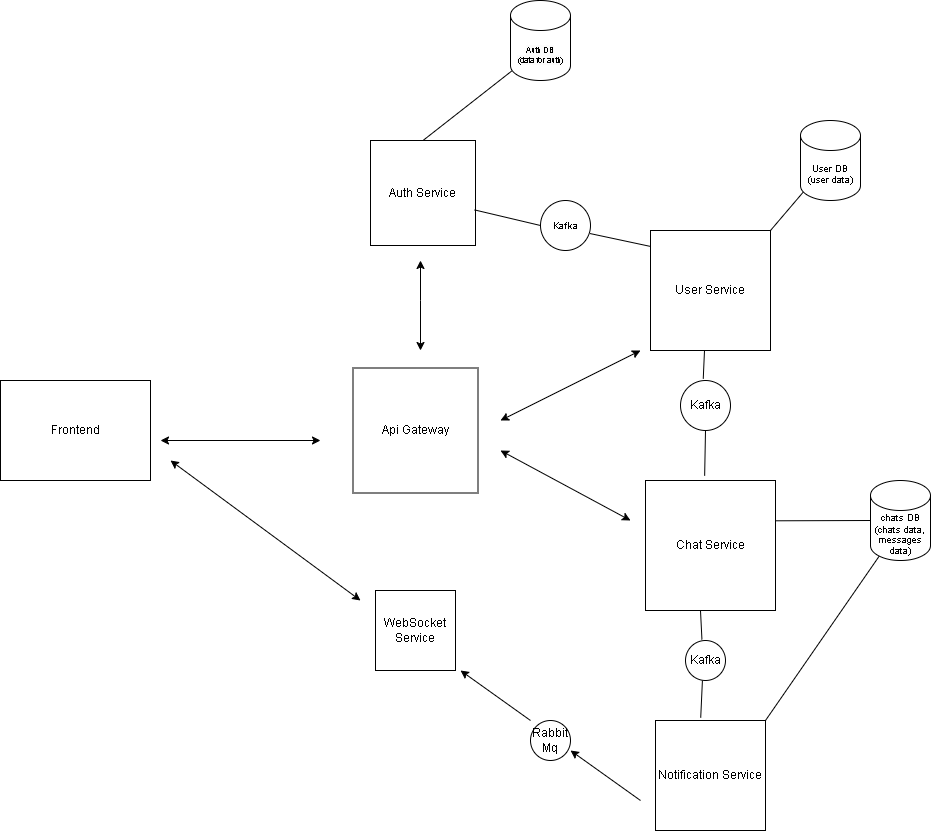

# Мессенджер на основе микросервисной архитектуры

**Microservice-Messenger** — это современное приложение для обмена сообщениями, построенное на архитектуре микросервисов и использующее передовые технологии для обеспечения масштабируемости и высокой производительности.

## Описание

Мессенджер поддерживает функциональность для обмена текстовыми сообщениями, создания групп. Аунтефикация и авторизация происходит при помощи JWT токенов(реализовано при помощи Spring Security). Приложение использует три БД PostgreSQL, что помогает ограничить зону ответственности каждого отдельного сервиса. Для асинхронного обновлениия одних и тех же данных в нескольких бд, используется Kafka. Для оптимизации работы основных реляционных бд и увеличения времени отклика, используется Redis, в котором хранится casche. Также для чистоты архитектуры и удобства работы с API используется Spring Cloud (Gateway) в качестве единой точки входа.

### Основные функции

- **Обмен сообщениями**: Отправка и получение текстовых сообщений. (Ведется работа над добавлением функций отправки и обработки медиафайлов)
- **Группы**: Создание групп для общения.
- **Безопасность**: Современные методы защиты аутентификации.

## Архитектура

### Технологический стек

- **Языки программирования**: Java
- **Фреймворки**:
  - **Spring Boot**: Для создания и управления микросервисами
  - **Spring Security**: Для обеспечения безопасности и аутентификации
- **Инфраструктура**:
  - **Apache Kafka**: Для асинхронного обмена сообщениями между микросервисами
  - **RabbitMQ**: Для очередей сообщений
  - **Redis**: Для кэширования данных
  - **PostgreSQL**: Для хранения данных пользователей и сообщений
